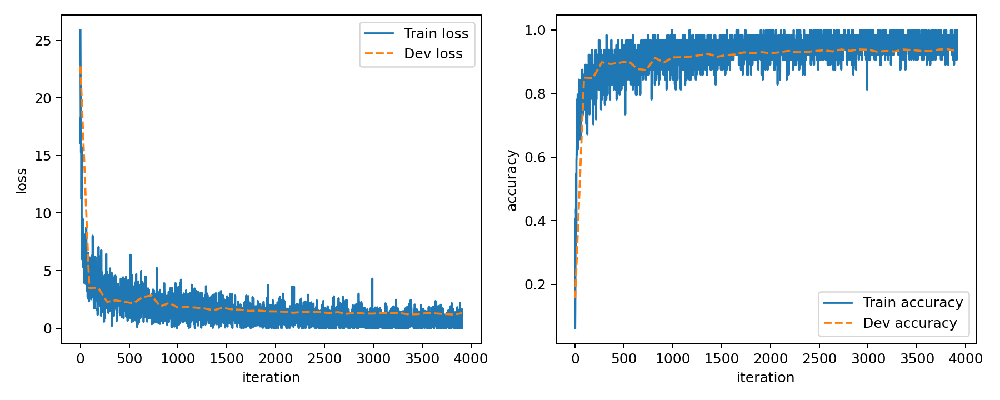
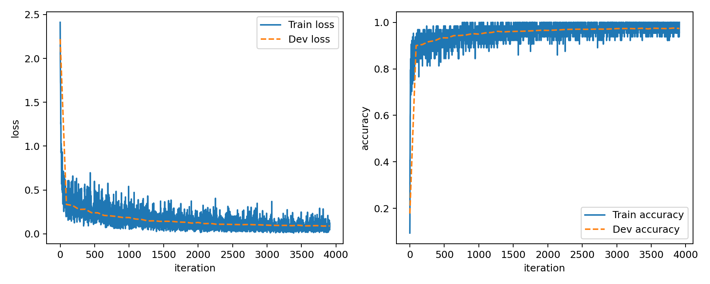
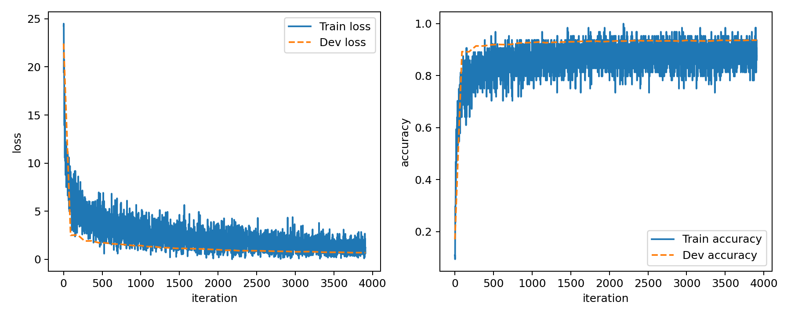
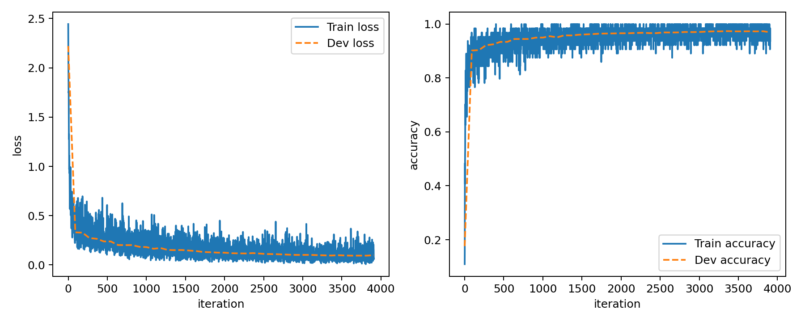
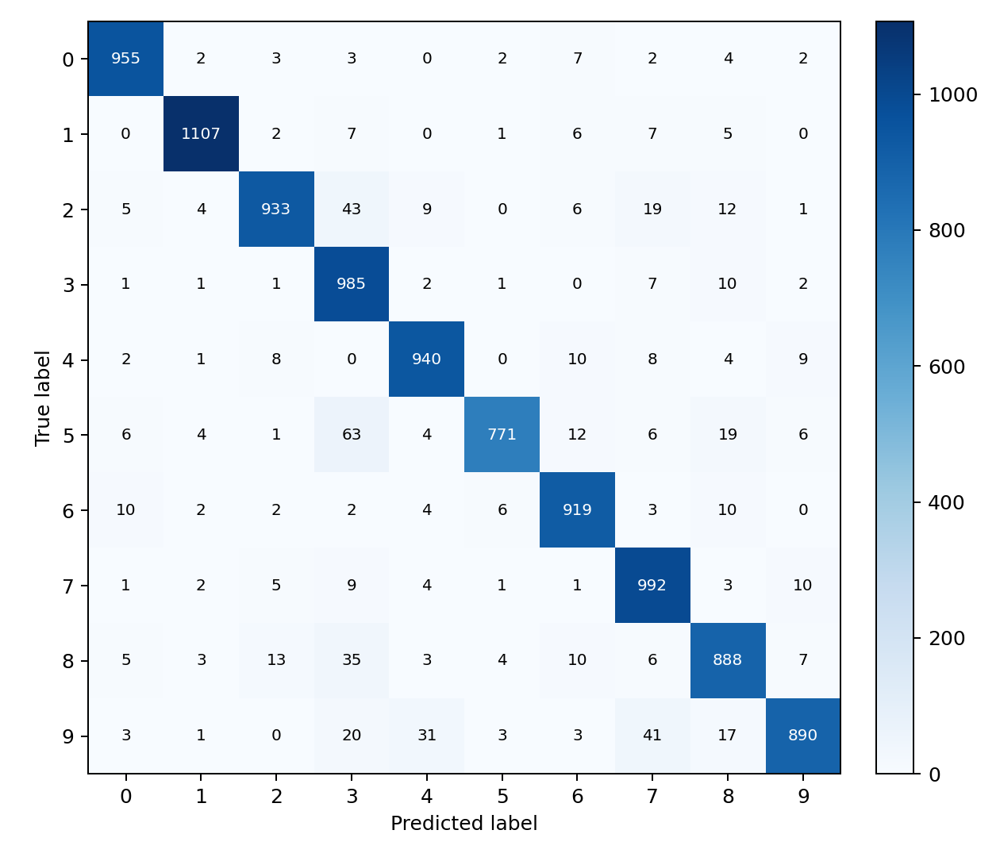
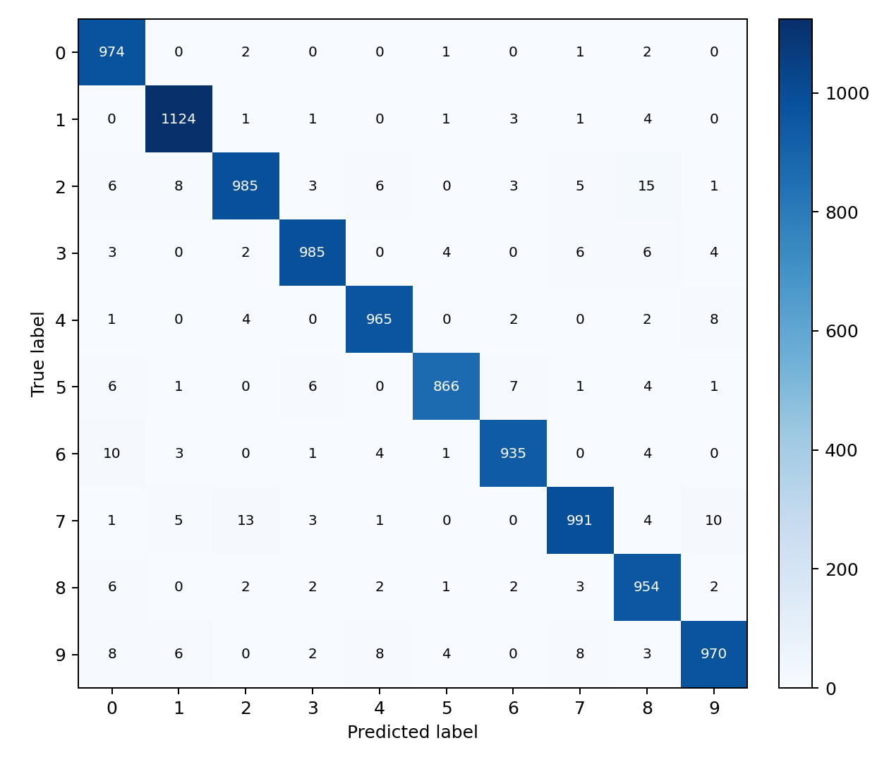
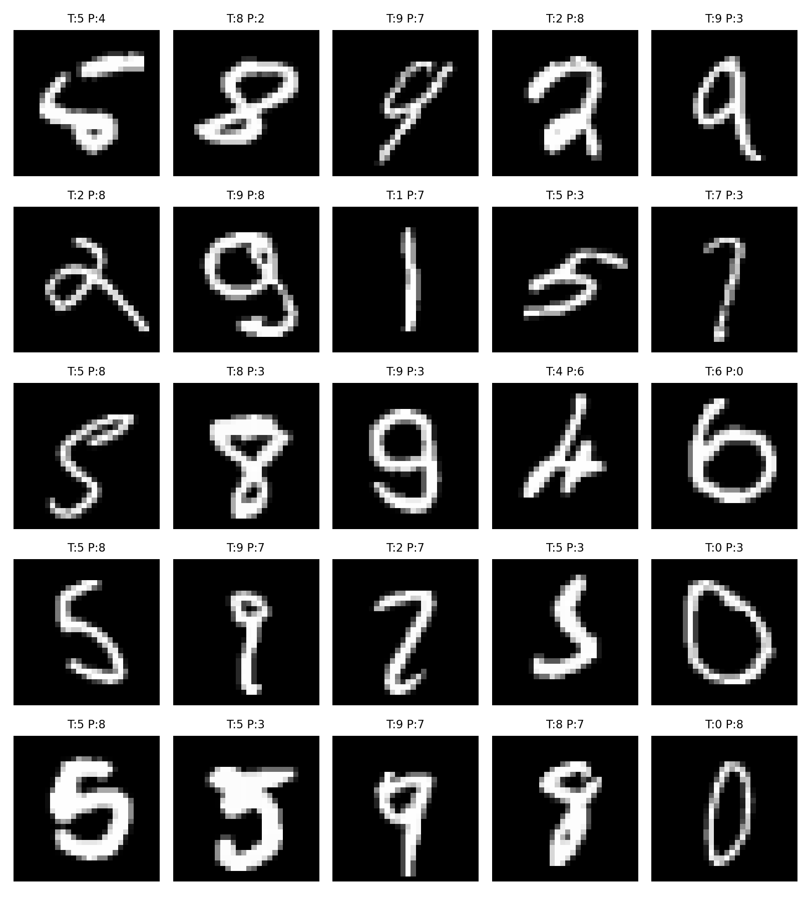
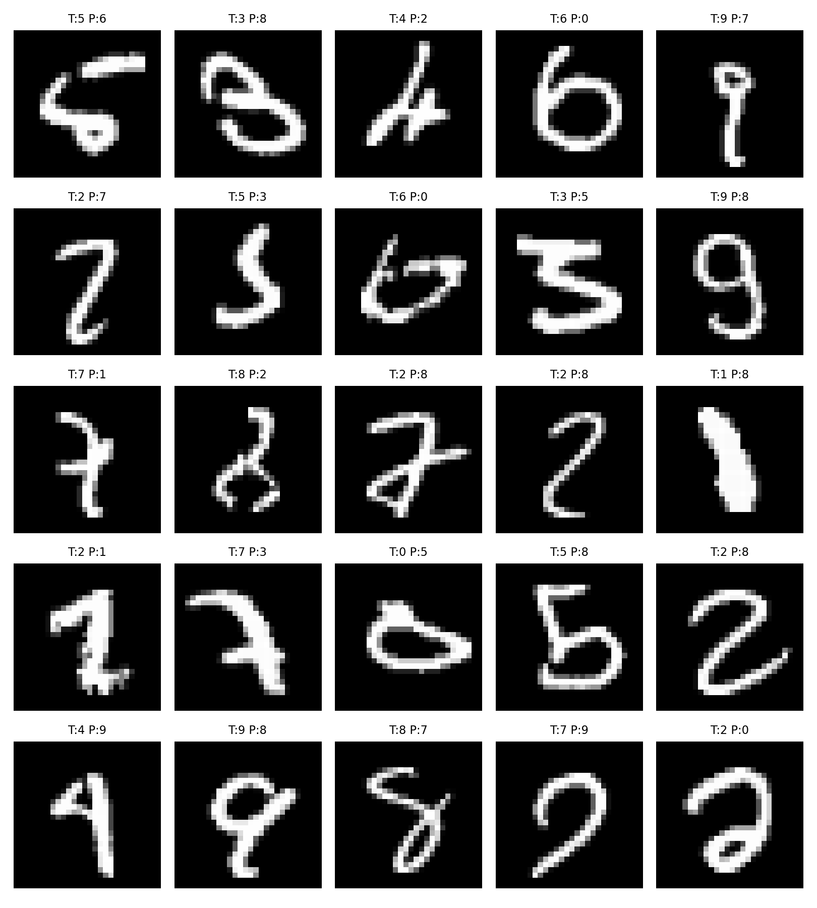
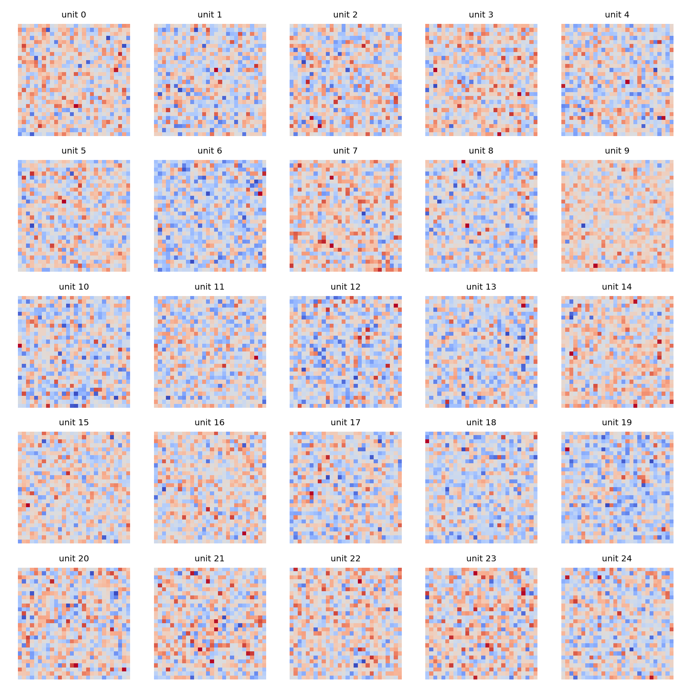
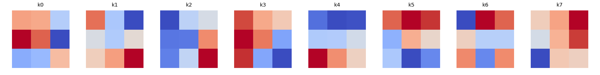

# Project 1: MNIST Classification with MLP and CNN

**Name:** 阎丞麟
**Student ID:** 23307110060  
**Code Repository:** TODO  
**Model Weights / Checkpoints:** TODO

## Abstract

This project implements basic neural-network components with NumPy and evaluates them on the MNIST handwritten digit classification task. I first implemented the required MLP baseline, including the linear layer forward/backward propagation and the softmax cross-entropy loss. I then implemented a simple CNN model with a self-written `conv2D` operator and compared it with the MLP under similar training settings. For the two additional directions, I chose regularization through dropout and error analysis/visualization. The final test accuracy is 93.80% for the MLP baseline and 97.49% for the CNN baseline. Dropout slightly improves the MLP to 94.00%, while it slightly decreases the CNN result to 97.38%. Error analysis shows that the CNN substantially reduces the number of misclassified samples and handles visually similar classes more robustly than the MLP.

## 1. Dataset and Experimental Setup

The experiments use the provided MNIST dataset only. MNIST contains 60,000 training images and 10,000 test images. Each image is a 28 x 28 grayscale digit image with label 0-9. I randomly split 10,000 samples from the training set as the validation set and used the remaining 50,000 samples for training. Pixel values are normalized from `[0, 255]` to `[0, 1]`.

The main training settings are:

| Model | Experiment | Epochs | Batch size | Learning rate | Main hyperparameters |
| --- | --- | ---: | ---: | ---: | --- |
| MLP | baseline | 5 | 64 | 0.06 | hidden dim = 600 |
| CNN | baseline | 5 | 64 | 0.05 | conv channels = 8, kernel = 3 x 3 |
| MLP | dropout | 5 | 64 | 0.06 | dropout rate = 0.5 |
| CNN | dropout | 5 | 64 | 0.05 | dropout rate = 0.3 |

The optimizer is SGD. All neural-network operators used for the required parts are implemented with NumPy rather than using deep learning frameworks.

## 2. Implementation

### 2.1 MLP Baseline

The MLP baseline has the structure:

```text
Input 784 -> Linear 600 -> ReLU -> Linear 10
```

For the linear layer, the forward pass computes:

```text
Y = XW + b
```

In the backward pass, the gradients are:

```text
dW = X^T dY
db = sum(dY)
dX = dY W^T
```

The multi-class cross-entropy loss includes softmax internally. For logits `z`, softmax probabilities are:

```text
p_i = exp(z_i - max(z)) / sum_j exp(z_j - max(z))
```

The loss is the mean negative log-likelihood over the batch, and the gradient w.r.t. logits is:

```text
(softmax(logits) - one_hot(label)) / batch_size
```

### 2.2 CNN Model

The CNN model has the structure:

```text
Input 1 x 28 x 28 -> Conv2D 8 channels, 3 x 3, padding 1 -> ReLU -> Flatten -> Linear 10
```

The convolution operator is implemented manually. The forward pass extracts local image windows and computes convolution responses. The backward pass computes gradients for the convolution weights, bias, and input feature map. This allows the CNN to be trained by the same SGD optimizer and loss function as the MLP.

Compared with the MLP, the CNN uses local receptive fields and weight sharing. These inductive biases are more suitable for image recognition because digit strokes are local patterns and can appear at slightly different positions.

## 3. Main Results

| Run | Model | Experiment | Best Validation Accuracy | Test Accuracy | Test Loss |
| --- | --- | --- | ---: | ---: | ---: |
| `mlp_baseline` | MLP | baseline | 0.9336 | 0.9380 | 1.2288 |
| `cnn_baseline` | CNN | baseline | 0.9735 | 0.9749 | 0.0820 |
| `mlp_dropout` | MLP | dropout | 0.9364 | 0.9400 | 0.6240 |
| `cnn_dropout` | CNN | dropout | 0.9721 | 0.9738 | 0.0937 |

The CNN baseline improves test accuracy by 3.69 percentage points compared with the MLP baseline:

```text
0.9749 - 0.9380 = 0.0369
```

The CNN also has a much smaller test loss, which suggests that its predictions are generally more confident  and better calibrated on correctly recognized samples.

## 4. Learning Curves

The learning curves are stored in `figs/learning_curves/`.

| Figure | Meaning |
| --- | --- |
| `figs/learning_curves/mlp_baseline_learning_curve.png` | MLP baseline training/validation loss and accuracy over training iterations. |
| `figs/learning_curves/cnn_baseline_learning_curve.png` | CNN baseline training/validation loss and accuracy over training iterations. |
| `figs/learning_curves/mlp_dropout_learning_curve.png` | MLP with dropout training/validation loss and accuracy. |
| `figs/learning_curves/cnn_dropout_learning_curve.png` | CNN with dropout training/validation loss and accuracy. |









From the curves, the CNN baseline reaches higher validation accuracy than the MLP baseline. The MLP with dropout has a slightly better test accuracy and lower test loss than the MLP baseline, showing that dropout helps reduce overfitting in the fully connected model. For the CNN, dropout does not improve the final test accuracy in this setting. This may be because the CNN already has a stronger image prior through local convolution and weight sharing, while the model is also relatively small and trained for only five epochs.

## 5. Additional Direction 1: Regularization with Dropout

For the regularization direction, I used dropout. During training, dropout randomly masks hidden activations and rescales the remaining activations. During evaluation, dropout is disabled. This is implemented as inverted dropout, so no additional scaling is needed at test time.

### 5.1 MLP Dropout

For the MLP, dropout is applied after the ReLU hidden layer. The dropout rate is 0.5. Compared with the MLP baseline:

| Model | Test Accuracy | Test Loss |
| --- | ---: | ---: |
| MLP baseline | 0.9380 | 1.2288 |
| MLP dropout | 0.9400 | 0.6240 |

Dropout improves the MLP test accuracy by 0.20 percentage points and reduces the test loss substantially. This indicates that the MLP benefits from regularization. Since the MLP has a large fully connected hidden layer, it can overfit to training examples more easily, and dropout helps it learn more robust hidden representations.

### 5.2 CNN Dropout

For the CNN, dropout is applied after flattening the convolutional features and before the final linear classifier. The dropout rate is 0.3. Compared with the CNN baseline:

| Model | Test Accuracy | Test Loss |
| --- | ---: | ---: |
| CNN baseline | 0.9749 | 0.0820 |
| CNN dropout | 0.9738 | 0.0937 |

Dropout slightly decreases the CNN test accuracy by 0.11 percentage points and slightly increases test loss. A possible explanation is that the CNN already has an implicit regularization effect through convolutional weight sharing. In addition, with only one convolutional layer and five training epochs, dropout may remove useful features before the final classifier and make optimization slightly harder.

Overall, dropout is more helpful for the MLP than for the simple CNN in this experiment.

## 6. Additional Direction 2: Error Analysis and Visualization

The error analysis and visualization figures are stored in `figs/mlp_baseline/` and `figs/cnn_baseline/`.

### 6.1 Meaning of Figures in `figs`

| Figure | Meaning |
| --- | --- |
| `figs/mlp_baseline/MLP_confusion_matrix.png` | Confusion matrix of the MLP baseline on the test set. Rows are true labels, columns are predicted labels. Diagonal entries are correct predictions; off-diagonal entries are errors. |
| `figs/mlp_baseline/MLP_misclassified.png` | Examples that the MLP classified incorrectly. Each title has `T` for the true label and `P` for the predicted label. |
| `figs/mlp_baseline/MLP_weights.png` | Visualization of selected first-layer MLP hidden-unit weights reshaped to 28 x 28 images. Red/blue colors indicate positive/negative weights. |
| `figs/cnn_baseline/CNN_confusion_matrix.png` | Confusion matrix of the CNN baseline on the test set. It can be directly compared with the MLP confusion matrix. |
| `figs/cnn_baseline/CNN_misclassified.png` | Examples that the CNN classified incorrectly. These are usually ambiguous or poorly written digits. |
| `figs/cnn_baseline/CNN_kernels.png` | Visualization of the learned 3 x 3 convolution kernels in the first convolution layer. The kernels capture local stroke/edge patterns. |

### 6.2 Confusion Matrix Analysis





The MLP baseline makes 620 mistakes on the 10,000 test images. The CNN baseline makes 251 mistakes. Therefore, the CNN reduces the number of errors by 369 samples.

The most frequent MLP confusions are:

| True label | Predicted label | Count |
| ---: | ---: | ---: |
| 5 | 3 | 63 |
| 2 | 3 | 43 |
| 9 | 7 | 41 |
| 8 | 3 | 35 |
| 9 | 4 | 31 |

The weakest MLP classes are label 5, label 9, label 2, and label 8. These classes often have shapes similar to other digits. For example, a poorly written 5 may resemble 3, and 9 may resemble 7 or 4.

The most frequent CNN confusions are:

| True label | Predicted label | Count |
| ---: | ---: | ---: |
| 2 | 8 | 15 |
| 7 | 2 | 13 |
| 6 | 0 | 10 |
| 7 | 9 | 10 |
| 9 | 7 | 8 |

The CNN still struggles with visually ambiguous digits, but the error counts are much smaller than those of the MLP. This confirms that the CNN extracts more useful spatial features from handwritten digits.

### 6.3 Misclassified Samples





The misclassified examples show that many errors are understandable even for a human observer. Some digits have distorted strokes, unusual writing styles, or incomplete shapes. Compared with the MLP, the CNN makes fewer mistakes, but its remaining errors are still concentrated on ambiguous digit pairs such as 2/8, 7/9, and 9/4.

### 6.4 Weight and Kernel Visualization



The MLP weight visualization shows selected hidden-unit weights from the first linear layer. Each hidden unit connects to all 784 input pixels, so the learned pattern is global. Some units correspond to broad digit-like templates or stroke patterns, but the features are less localized and less translation-invariant.



The CNN kernel visualization shows learned 3 x 3 filters. These filters are local and capture small stroke or edge patterns. Because the same kernel is applied across the whole image, the CNN can detect similar local patterns at different positions. This explains why the CNN is more suitable for image classification than the MLP.

## 7. Discussion

### 7.1 Why CNN Performs Better Than MLP

The CNN baseline clearly outperforms the MLP baseline. The main reason is that handwritten digits are spatial data. Nearby pixels have strong relationships, and digit identity depends on local strokes and their spatial arrangement. The MLP flattens the image into a 784-dimensional vector and treats each pixel as an independent input feature. It can still learn useful patterns, but it does not explicitly use locality or weight sharing.

The CNN, in contrast, uses convolution kernels to scan local regions. This gives the model two advantages:

1. Local feature extraction: it can learn small strokes, corners, and edge-like patterns.
2. Weight sharing: the same feature detector can work at different image positions.

These properties allow the CNN to generalize better, which is reflected in both the higher test accuracy and the lower test loss.

### 7.2 Effect of Dropout

Dropout improves the MLP slightly but does not improve the CNN in this setup. This suggests that the MLP has more need for explicit regularization. The CNN is already constrained by convolutional structure and has fewer effective degrees of freedom than a fully connected model over all pixels. Therefore, applying dropout before the final classifier may remove useful convolutional features without providing enough additional benefit.

### 7.3 Remaining Hard Samples

The remaining hard samples are mostly ambiguous handwriting cases. For the MLP, common confusions include 5 -> 3, 2 -> 3, and 9 -> 7. For the CNN, the most common confusions include 2 -> 8, 7 -> 2, and 6 -> 0. These mistakes often happen when the digit is written with missing strokes, extra loops, or unusual slant.

## 8. Conclusion

This project implemented a NumPy-based neural network pipeline for MNIST classification. The MLP baseline reaches 93.80% test accuracy, while the self-implemented CNN reaches 97.49%. The CNN is clearly more effective for image classification because it uses local receptive fields and shared convolution kernels. For the additional directions, dropout regularization is beneficial for the MLP but not for the simple CNN in this setting. Error analysis further shows that the CNN reduces both the total number of mistakes and the severity of class confusions. The visualizations support the same conclusion: MLP hidden units learn global pixel templates, while CNN kernels learn reusable local stroke features.

